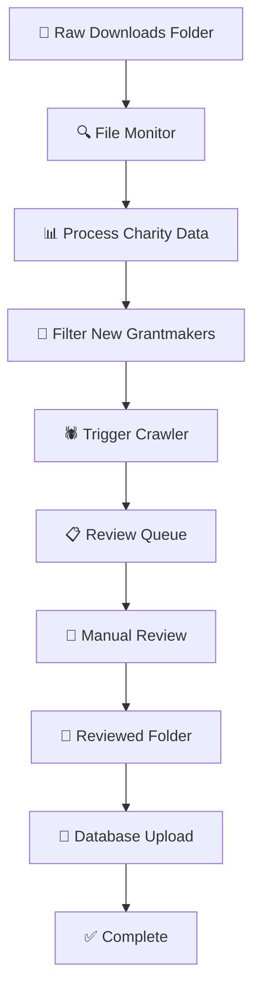

# Monthly Charity Register Processing System

## Overview

This system provides a fully automated workflow for processing UK Charity Commission register downloads, filtering for new grantmaking trusts and foundations, and managing the review process. The system uses structured classification codes from the Charity Commission to identify grantmaking organizations and ensures every new registration gets proper classification.

## System Architecture



## Quick Start

### 1. Setup

```bash
# Install dependencies
pip install -r requirements.txt

# Run database migration
python migration_monthly_tracking.py

# Create directory structure
mkdir -p /data/{raw_downloads,processed,review_queue,reviewed,archive,logs}
```

### 2. Monthly Workflow

**Step 1: Download Charity Register**
1. Go to: https://register-of-charities.charitycommission.gov.uk/register/full-register-download
2. Download the charity register ZIP file
3. Save to `/data/raw_downloads/`

**Step 2: Automated Processing**
- System automatically detects new file
- Processes and filters for new grantmaking trusts
- Creates review queue
- Triggers crawler for qualifying entries

**Step 3: Manual Review**
1. Open review queue CSV file
2. Research each charity using provided links
3. Classify using 7 options
4. Save completed file to `/data/reviewed/`

**Step 4: Database Import**
- System automatically detects reviewed file
- Imports to database
- Archives processed files

## Detailed Components

### 1. Monthly Charity Processor (`monthly_charity_processor.py`)

**Main Features:**
- **File Monitoring**: Watches folders for new files
- **Data Processing**: Filters using Charity Commission codes
- **Date Filtering**: Identifies previous month's registrations
- **Crawler Integration**: Triggers main pipeline
- **Review Queue Creation**: Generates review templates

**Usage:**
```bash
# Start monitoring (runs continuously)
python monthly_charity_processor.py --mode monitor

# Process specific file
python monthly_charity_processor.py --mode process --file /path/to/file.zip

# Download latest data
python monthly_charity_processor.py --mode download
```

### 2. Database Migration (`migration_monthly_tracking.py`)

**Adds Tables:**
- `monthly_imports` - Tracks monthly processing runs
- Enhanced `funders` table with review fields

**Columns Added:**
- `monthly_import_id` - Links to import tracking
- `initial_classification` - AI's initial guess
- `manual_review_classification` - Reviewer's classification
- `review_notes` - Reviewer notes
- `reviewer_name` - Who reviewed
- `review_date` - When reviewed

**Usage:**
```bash
# Run migration
python migration_monthly_tracking.py

# Rollback (if needed)
python migration_monthly_tracking.py --rollback
```

### 3. Review Interface Generator (`review_interface_generator.py`)

**Creates Review Templates:**
- CSV files with all charity data
- Charity Commission URLs for verification
- Initial AI classifications
- 7 classification dropdown options

**Usage:**
```bash
# Create template from JSON data
python review_interface_generator.py --create-template trusts.json --output-dir ./reviews

# Create standalone instructions
python review_interface_generator.py --create-instructions instructions.md

# Validate completed review
python review_interface_generator.py --validate completed_review.csv
```

## Classification System

### 7 Classification Options

1. **Grantmaking Trust**
   - Traditional charitable trusts that make grants
   - Primary activity is providing funding to others

2. **Grantmaking Foundation**
   - Charitable foundations that provide funding
   - Similar to trusts but typically newer structures

3. **Operational Charity (provides services)**
   - Charities that directly provide services
   - Not primarily grantmaking

4. **Fundraising Charity**
   - Organizations focused on fundraising activities
   - May support other charities

5. **Religious Organization**
   - Churches, mosques, temples, religious education
   - Even if grantmaking, classify as religious if primary purpose

6. **Educational Institution**
   - Schools, colleges, universities
   - Educational charities and scholarship providers

7. **Other (specify)**
   - Use for anything else
   - Must specify details in notes

### Filtering Logic

The system uses **structured filters** from the Charity Commission:

```python
# Primary filters
operational_method = 'Makes Grants To Organisations'
grantmaking_flag = 'Main way of carrying out purposes is grant making'

# Date filter
registration_date >= first_day_of_previous_month
registration_date < first_day_of_current_month
```

## Directory Structure

```
/data/
├── raw_downloads/          # New charity register ZIP files
│   └── charity_register_2025_12.zip
├── processed/             # Extracted and processed data
│   ├── charity_register_2025_12/
│   └── trusts_to_crawl_20251213_143022.json
├── review_queue/          # Files ready for review
│   └── review_queue_20251213_143022.csv
├── reviewed/              # Completed review files
│   └── reviewed_review_queue_20251213_143022.csv
├── archive/               # Completed files
│   ├── processed_charity_register_2025_12.zip
│   └── reviewed_review_queue_20251213_143022.csv
└── logs/                  # Processing logs
    └── monthly_processing.log
```

## Review Process

### For Reviewers

1. **Open Review File**
   - CSV file in `/data/review_queue/`
   - Contains all charities needing review

2. **Research Each Charity**
   - Click Charity Commission URL
   - Check official registration details
   - Look up website if provided
   - Review initial AI classification

3. **Make Classification**
   - Choose from 7 dropdown options
   - Add reasoning in notes
   - Set confidence level

4. **Complete Required Fields**
   - Website URL (if found)
   - Reviewer name
   - Review date
   - Classification notes

### Review Template Structure

| Column | Description | Example |
|--------|-------------|---------|
| regno | Charity registration number | 1234567 |
| charity_name | Official charity name | ABC Community Trust |
| registration_date | Date registered | 2025-11-15 |
| current_status | Registration status | Registered |
| website_url | Charity website | https://abc.org |
| initial_classification | AI's guess | Grantmaking Trust |
| manual_classification | **Your classification** | Grantmaking Trust |
| classification_notes | Your reasoning | Makes grants to local charities |
| reviewer_name | Your name | John Smith |
| review_date | Today's date | 2025-12-13 |

## Integration with Main Pipeline

### Crawler Trigger

When new grantmaking trusts are identified:

1. **Queue Creation**: Trusts saved to JSON file
2. **Pipeline Integration**: Main crawler processes queue
3. **Change Detection**: Only processes changed websites
4. **Opportunity Generation**: Creates funding opportunities
5. **Database Storage**: Stores results with tracking

### Database Tracking

Each import tracked with:
- Import date and source file
- Total charities processed
- Grantmakers found
- Crawler status
- Review completion
- Database import status

## Error Handling

### Common Issues

1. **File Not Detected**
   - Check file is in correct directory
   - Verify file format (.zip or .csv)
   - Check file permissions

2. **Processing Errors**
   - Review logs in `/data/logs/`
   - Check Charity Commission data format
   - Verify database connectivity

3. **Review Validation Failed**
   - Missing required columns
   - Invalid classification options
   - Incomplete entries

### Recovery Procedures

```bash
# Retry failed processing
python monthly_charity_processor.py --mode process --file failed_file.zip

# Validate review file
python review_interface_generator.py --validate problematic_review.csv

# Check database status
psql -h $DB_HOST -U $DB_USER -d $DB_NAME -c "SELECT * FROM monthly_imports ORDER BY created_at DESC LIMIT 5;"
```

## Monitoring and Reporting

### System Status

Monitor processing with:

```bash
# Check recent imports
python -c "
import psycopg2
import os
conn = psycopg2.connect(
    host=os.getenv('DB_HOST'),
    user=os.getenv('DB_USER'), 
    password=os.getenv('DB_PASSWORD'),
    database=os.getenv('DB_NAME')
)
cursor = conn.cursor()
cursor.execute('SELECT * FROM current_month_imports')
for row in cursor.fetchall():
    print(row)
"

# Check review status
python -c "
import psycopg2
import os
conn = psycopg2.connect(
    host=os.getenv('DB_HOST'),
    user=os.getenv('DB_USER'),
    password=os.getenv('DB_PASSWORD'), 
    database=os.getenv('DB_NAME')
)
cursor = conn.cursor()
cursor.execute('SELECT * FROM review_status_summary')
for row in cursor.fetchall():
    print(row)
"
```

### Log Files

Check processing logs:
```bash
tail -f /data/logs/monthly_processing.log
```

## Best Practices

### Monthly Processing

1. **Consistent Timing**: Process on same day each month
2. **File Naming**: Use consistent naming for tracking
3. **Review Quality**: Complete all entries, add detailed notes
4. **Backup**: Archive important review files

### Data Quality

1. **Website Verification**: Always check charity websites
2. **Classification Accuracy**: Use detailed notes for edge cases
3. **Reviewer Training**: Understand the 7 classification options
4. **Quality Checks**: Validate before submission

### System Maintenance

1. **Log Rotation**: Archive old log files regularly
2. **Database Cleanup**: Remove old import records
3. **Directory Management**: Archive completed files
4. **Monitoring**: Check system health regularly

## API Integration

### Webhook Support

The system can trigger webhooks for:
- New review queue created
- Review completed
- Database import finished
- Processing errors

### External Systems

Integrates with:
- Main grantseeker pipeline
- Notification systems
- External review tools
- Data quality dashboards

## Support and Troubleshooting

### Getting Help

1. **Check Logs**: First step for any issue
2. **Validate Files**: Use built-in validation tools
3. **Database Queries**: Check tracking tables
4. **Test Mode**: Use small files for testing

### Common Solutions

**Processing Stops**: Check database connectivity and file permissions

**Review Validation Fails**: Ensure all required fields are completed

**Crawler Not Triggered**: Verify trust classification and database status

**Import Errors**: Check data format and database constraints

---

## Summary

This system provides a complete automated workflow for monthly charity processing:

- ✅ **Automated Detection**: Monitors folders for new files
- ✅ **Smart Filtering**: Uses Charity Commission structured codes
- ✅ **Date Filtering**: Identifies previous month's registrations
- ✅ **Crawler Integration**: Triggers main pipeline automatically
- ✅ **Manual Review**: 7 classification options with validation
- ✅ **Database Tracking**: Complete audit trail
- ✅ **Error Handling**: Robust recovery procedures

The system ensures no new grantmaking trust is missed while maintaining high data quality through manual review.