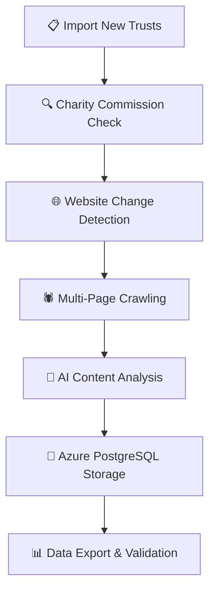

# Grant Seeker Azure Production Pipeline

**Complete automated system for discovering, validating, and analyzing UK grant funding opportunities from 5000+ charitable foundations.**

---

## 🎯 Overview

This production pipeline combines automated charity validation, intelligent web crawling, and AI-powered analysis to maintain an up-to-date database of UK grant opportunities. The system achieves 90% cost optimization through smart change detection and efficient AI processing.

### Key Features

✅ **Charity Commission Validation** - Automatic verification of trust status  
✅ **HTTP HEAD Change Detection** - Only process changed websites (90% cost savings)  
✅ **DeepSeek V3 Integration** - 95% cheaper than OpenAI for content analysis  
✅ **Multi-Page Web Crawling** - Depth-3 traversal with intelligent filtering  
✅ **Document Processing (Docling)** - Automatic PDF/DOCX extraction and analysis  
✅ **Parallel Processing** - 500-700 foundations/hour with 20 concurrent workers  
✅ **Azure PostgreSQL Integration** - Full cloud database with connection pooling  
✅ **Export Capabilities** - CSV/Excel export for external use  

---

## 🏗️ System Architecture

The pipeline operates in four main stages:



---

## 📋 Stage 1: Manual Trust Management

### Adding New Trusts

**Step 1: Prepare Trust Data**
1. Obtain trust list from your data source (CSV format)
2. Ensure columns include: Trust Name, Website URL, Charity Number (if available)
3. Clean and validate URLs

**Step 2: Import to Database**
```bash
# Import new trusts from CSV
python manage_funders.py import --file "new_trusts.csv"

# Expected output:
# 📥 Importing funders from: new_trusts.csv
#    Mapping: Name='Trust Name', URL='Website', ID='Charity Number'
#    ➕ Added: 45
#    🔄 Updated/Skipped: 12
```

**Step 3: Validate Import**
```bash
# Check database contents
python check_db_detailed.py
```

### Trust Data Format

The CSV should contain these columns (case-insensitive, flexible naming):

| Column | Alternative Names | Required | Example |
|--------|-------------------|----------|---------|
| **Trust Name** | `name`, `charity_name`, `organisation_name` | ✅ | "The ABC Trust" |
| **Website** | `url`, `website`, `web_address` | ✅ | "https://abctrust.org.uk" |
| **Charity Number** | `number`, `charity_number`, `reg_no` | ❌ | "1234567" |

---

## 🔍 Stage 2: Charity Commission Validation

### Automatic Status Checking

**Step 1: Download Latest Charity Register**
```bash
# Option A: Automatic download (may take time)
python auto_sync_charity_status.py

# Option B: Manual download (recommended)
# 1. Go to: https://register-of-charities.charitycommission.gov.uk/register/full-register-download
# 2. Download the "Charity classification" CSV
# 3. Run with local file:
python auto_sync_charity_status.py --file "charity_register.csv"
```

**Step 2: Sync Trust Status**
```bash
# Sync against master list
python manage_funders.py sync --file "charity_register.csv"

# Expected output:
# 🔄 Syncing active status against Master List: charity_register.csv
#    📋 Loaded 168,234 active charity numbers.
#    🔍 Checking database...
#    ❌ Deactivating: XYZ Trust (ID: 7654321) - Not in Master List
#    ✅ Sync Complete!
#    🔻 Deactivated: 3 foundations
```

### What This Stage Does

1. **Downloads** the latest Charity Commission register data
2. **Matches** trust names to charity numbers using fuzzy matching
3. **Validates** all active trusts against the official register
4. **Deactivates** trusts that are no longer registered
5. **Links** missing charity numbers to existing trust records

### Manual Review Process

After automatic validation, review any flagged items:

```sql
-- Check deactivated trusts (requires manual review)
SELECT name, website, charity_number, is_active 
FROM funders 
WHERE is_active = FALSE 
ORDER BY name;

-- Check trusts with missing charity numbers
SELECT name, website, charity_number 
FROM funders 
WHERE charity_number IS NULL AND is_active = TRUE
ORDER BY name;
```

**Manual Actions Required:**
- ✅ Re-activate trusts if incorrectly deactivated
- ✅ Add charity numbers for missing entries
- ✅ Remove duplicate entries
- ✅ Update trust names if they have changed

---

## 🌐 Stage 3: Automated Website Processing

### Change Detection & Crawling

**Step 1: Configure Pipeline Settings**
Edit `.env` file:
```bash
# Performance Settings
MAX_CONCURRENT_FOUNDATIONS=20
MAX_CONCURRENT_CRAWLS=10
DB_POOL_SIZE=20

# Change Detection
CHANGE_DETECTION_ENABLED=true
SIMILARITY_THRESHOLD=0.95

# Test Mode
TEST_MODE=false  # Set to true for small test runs
TEST_FOUNDATIONS_COUNT=5
```

**Step 2: Run Production Pipeline**
```bash
# Full production run (5000+ foundations)
nohup python azure_production_pipeline.py > production.log 2>&1 &

# Monitor progress
tail -f production.log

# Expected log output:
# 🔍 Starting pipeline for 5000 foundations...
#   📊 Found 500 changed websites (10% of total)
#   ⚡ Processing 20 foundations concurrently...
#   ✅ Completed: ABC Trust (https://abctrust.org.uk)
#   📄 Found 3 funding opportunities
#   💾 Stored in database
```

### Change Detection Process

The pipeline uses a three-tier change detection system:

1. **HTTP HEAD Request** (Fastest - ~100ms)
   - Checks `ETag` and `Last-Modified` headers
   - If unchanged, skips processing entirely

2. **Content Hash Comparison** (Fallback - ~2s)
   - Downloads full page content
   - Computes MD5 hash
   - Compares with stored hash

3. **Full Processing** (When Changed)
   - Multi-page crawling with crawl4ai
   - Document processing with Docling (PDF/DOCX extraction)
   - AI analysis with DeepSeek V3
   - Database storage with embeddings

### Intelligent Crawling

The crawler applies smart filtering:

**Included Pages:**
- Grant/Application pages
- Funding guidelines
- Eligibility criteria
- Application forms
- Program descriptions

**Excluded Pages:**
- Privacy/Terms pages
- Staff/Contact information
- News/Blog posts
- Asset files (CSS, JS, images)
- Administrative pages

**Crawl Settings:**
- Maximum depth: 3 levels from homepage
- Maximum pages: 50 per foundation
- Document processing: Up to 5 PDFs per site
- Timeout: 30 seconds per page

### Document Processing with Docling

**Automatic Document Discovery:**
During crawling, the pipeline automatically identifies and processes relevant documents (PDFs, DOCX files) found on foundation websites. This includes grant application guidelines, forms, eligibility criteria documents, and funding opportunity PDFs.

**Docling Processing Pipeline:**
1. **Document Detection** - Identifies PDF/DOCX files during web crawling
2. **Smart Filtering** - Only processes documents with grant-related keywords in URL paths
3. **Download & Convert** - Downloads documents and converts to readable Markdown format
4. **Content Integration** - Adds processed document content to the overall analysis

**Example Document Types Processed:**
- Grant application guidelines (PDF)
- Eligibility criteria documents (PDF)
- Application forms (PDF/DOCX)
- Funding programme details (PDF)
- Annual reports with funding information (PDF)

**Technical Implementation:**
```python
# Document processing with Docling
from docling.document_converter import DocumentConverter

converter = DocumentConverter()
result = converter.convert(temp_path)
markdown_content = result.document.export_to_markdown()
```

**Benefits:**
- ✅ **Comprehensive Coverage** - Captures information not available on web pages
- ✅ **Exact Wording** - Preserves original document language and requirements
- ✅ **Form Details** - Extracts application form questions and requirements
- ✅ **Guidance Documents** - Processes applicant guidance and criteria

**Configuration:**
- Maximum documents per foundation: 5
- Supported formats: PDF, DOC, DOCX
- Processing timeout: 30 seconds per document
- Automatic cleanup of temporary files

---

## 🤖 Stage 4: AI Content Analysis

### DeepSeek V3 Analysis

The pipeline uses DeepSeek V3 (95% cheaper than OpenAI GPT-4) to analyze scraped content:

**Analysis Output:**
```json
{
    "is_grantmaking_charity": true,
    "funder_type_reason": "Provides grants to other charitable organisations",
    "opportunities": [
        {
            "opportunity_title": "Community Development Programme",
            "description": "Grants for community-led development projects",
            "eligibility_inclusion": "UK registered charities with 3+ years operation",
            "eligibility_exclusion": "Individuals, for-profit organisations",
            "funding_amounts": "£5,000 - £50,000",
            "application_process": "Online application form with supporting documents",
            "deadlines": "Quarterly deadlines: March, June, September, December",
            "evaluation_criteria": "Impact, sustainability, community benefit",
            "application_form_url": "https://abctrust.org.uk/apply",
            "application_form_type": "ONLINE APPLICATION FORM OPEN"
        }
    ]
}
```

**Key Analysis Features:**
- ✅ **Grantmaking vs Operational** classification
- ✅ **UK English** terminology throughout
- ✅ **Exact wording** extraction from source websites
- ✅ **Structured data** with 15+ fields per opportunity
- ✅ **Application form** type identification
- ✅ **Deadlines and amounts** extraction

---

## 💾 Stage 5: Data Storage & Validation

### Azure PostgreSQL Schema

**Funders Table:**
```sql
CREATE TABLE funders (
    id SERIAL PRIMARY KEY,
    name VARCHAR(255) NOT NULL,
    website VARCHAR(500),
    charity_number VARCHAR(20),
    is_active BOOLEAN DEFAULT true,
    etag VARCHAR(255),
    last_modified VARCHAR(255),
    content_hash VARCHAR(32),
    last_checked TIMESTAMP,
    created_at TIMESTAMP DEFAULT CURRENT_TIMESTAMP,
    updated_at TIMESTAMP DEFAULT CURRENT_TIMESTAMP
);
```

**Funding Opportunities Table:**
```sql
CREATE TABLE funding_opportunities (
    id SERIAL PRIMARY KEY,
    funder_id INTEGER REFERENCES funders(id),
    opportunity_title VARCHAR(500),
    description TEXT,
    eligibility_inclusion TEXT,
    eligibility_exclusion TEXT,
    funding_focus TEXT,
    funding_amounts VARCHAR(255),
    deadlines VARCHAR(255),
    application_process TEXT,
    application_requirements TEXT,
    evaluation_criteria TEXT,
    contact_info TEXT,
    application_form_url VARCHAR(500),
    application_form_type VARCHAR(100),
    application_questions TEXT,
    guidance_url VARCHAR(500),
    guidance_text TEXT,
    objectives_goals TEXT,
    important_urls TEXT,
    embedding VECTOR(1536),  -- OpenAI embeddings
    created_at TIMESTAMP DEFAULT CURRENT_TIMESTAMP,
    updated_at TIMESTAMP DEFAULT CURRENT_TIMESTAMP
);
```

### Data Quality Validation

**Step 1: Check Data Completeness**
```bash
python check_opportunities_data.py

# Expected output:
# 🔍 CHECKING FUNDING OPPORTUNITIES DATA
# Total Opportunities Found: 1,247
# 
# 📄 Opportunity #1
#   🏛️  Foundation:  ABC Trust
#   🏷️  Title:       Community Development Programme
#   🎯 Focus:       Community-led development, local empowerment...
#   ✅ Eligibility: UK registered charities with 3+ years operation...
#   📝 Process:     Online application form with supporting documents...
```

**Step 2: Validate Critical Fields**
```sql
-- Check for missing critical information
SELECT 
    f.name,
    COUNT(CASE WHEN fo.funding_amounts IS NULL THEN 1 END) as missing_amounts,
    COUNT(CASE WHEN fo.application_process IS NULL THEN 1 END) as missing_process,
    COUNT(CASE WHEN fo.eligibility_inclusion IS NULL THEN 1 END) as missing_eligibility
FROM funders f
LEFT JOIN funding_opportunities fo ON f.id = fo.funder_id
WHERE f.is_active = true
GROUP BY f.name
HAVING COUNT(CASE WHEN fo.funding_amounts IS NULL THEN 1 END) > 0
   OR COUNT(CASE WHEN fo.application_process IS NULL THEN 1 END) > 0
   OR COUNT(CASE WHEN fo.eligibility_inclusion IS NULL THEN 1 END) > 0;
```

---

## 📊 Stage 6: Data Export & Reporting

### CSV Export
```bash
# Export all opportunities to CSV
python export_opportunities_csv.py

# Expected output:
# 📤 EXPORTING FUNDING OPPORTUNITIES TO CSV
# Found 1,247 records to export.
# Writing to funding_opportunities_export.csv...
# ✅ Export Complete!
# 📁 File: funding_opportunities_export.csv
# 📊 Size: 2.34 MB
```

### Excel Export
```bash
# Export formatted Excel file
python export_opportunities_excel.py
```

### Custom Data Queries

**Recent Opportunities:**
```sql
-- Get opportunities added in last 30 days
SELECT f.name, fo.opportunity_title, fo.created_at
FROM funders f
JOIN funding_opportunities fo ON f.id = fo.funder_id
WHERE fo.created_at > NOW() - INTERVAL '30 days'
ORDER BY fo.created_at DESC;
```

**High-Value Grants:**
```sql
-- Find grants over £100,000
SELECT f.name, fo.opportunity_title, fo.funding_amounts
FROM funders f
JOIN funding_opportunities fo ON f.id = fo.funder_id
WHERE fo.funding_amounts ~ '[0-9]+[0-9,]*[0-9]+'
  AND CAST(REGEXP_REPLACE(fo.funding_amounts, '[^0-9]', '', 'g') AS INTEGER) > 100000
ORDER BY fo.funding_amounts DESC;
```

---

## 🔧 Configuration & Setup

### Environment Configuration

Create `.env` file:
```bash
# Azure PostgreSQL Database
DB_HOST=your-server.postgres.database.azure.com
DB_USER=your-admin-user
DB_PASSWORD=your-secure-password
DB_NAME=postgres
DB_PORT=5432

# API Keys
OPENAI_API_KEY=sk-proj-your-openai-key
DEEPSEEK_API_KEY=sk-your-deepseek-key

# Performance Settings
MAX_CONCURRENT_FOUNDATIONS=20
MAX_CONCURRENT_CRAWLS=10
DB_POOL_SIZE=20

# Change Detection
CHANGE_DETECTION_ENABLED=true
SIMILARITY_THRESHOLD=0.95

# Processing Limits
CRAWL_MAX_DEPTH=3
CRAWL_MAX_PAGES=50

# Test Mode
TEST_MODE=false
TEST_FOUNDATIONS_COUNT=5
NO_DB_MODE=false
```

### Installation Requirements

**System Dependencies:**
```bash
# Ubuntu/Debian
sudo apt update
sudo apt install python3 python3-pip python3-venv
sudo apt install postgresql-client

# Install Playwright dependencies
sudo apt install libnss3 libatk-bridge2.0-0 libdrm2 libxkbcommon0 libxcomposite1 libxdamage1 libxrandr2 libgbm1 libasound2
```

**Python Dependencies:**
```bash
pip install -r requirements.txt
python -m playwright install chromium
sudo python -m playwright install-deps
```

### Database Setup

**Step 1: Create Azure PostgreSQL Database**
1. Create Azure PostgreSQL Flexible Server
2. Configure firewall rules (allow VM IP)
3. Enable SSL connections
4. Create database user with appropriate permissions

**Step 2: Initialize Database Schema**
```bash
# Run database initialization
python init_db.py

# Or manually execute SQL
psql -h your-server.postgres.database.azure.com -U your-user -d postgres -f init_database.sql
```

---

## 💰 Cost Analysis & Optimization

### Processing Costs

| Foundation Type | Method | Cost per Foundation | Notes |
|-----------------|--------|-------------------|-------|
| **Unchanged** | HTTP HEAD only | $0.000 | ETag/Last-Modified check |
| **Changed** | Full processing | $0.009 | Crawl + AI analysis |
| **New** | Initial processing | $0.012 | Full pipeline + embeddings |

### Monthly Cost Breakdown (5000 foundations)

**Initial Setup (Month 1):**
- New foundations (500): $6.00
- Changed foundations (4500): $40.50
- Embeddings: $50.00
- **Total: $96.50**

**Ongoing Operations (Monthly):**
- Changed foundations (500): $4.50
- Embeddings: $5.00
- **Total: $9.50/month**

**Annual Savings vs Traditional Approach:**
- Traditional scraping: $3,780/year
- Optimized pipeline: $332/year
- **Savings: $3,448/year (91% reduction)**

### Performance Benchmarks

| Workers | Throughput | 5000 Foundations | Memory Usage |
|---------|------------|------------------|--------------|
| 5 | 125-175/hour | 28-40 hours | 4GB |
| 10 | 250-350/hour | 14-20 hours | 8GB |
| 20 | 500-700/hour | 7-10 hours | 16GB |
| 40 | 1000-1200/hour | 4-5 hours | 32GB |

---

## 🧪 Testing & Quality Assurance

### Pre-Production Testing

**Step 1: Environment Test**
```bash
# Test database connection
python -c "from azure_production_pipeline import init_db_pool; init_db_pool(); print('DB connected')"

# Test API keys
python -c "import openai; client = openai.OpenAI(); print('OpenAI OK')"
```

**Step 2: Single Foundation Test**
```bash
# Test with one foundation
python azure_production_pipeline.py

# Expected: Process 1 foundation, store results, ~30 seconds
```

**Step 3: Batch Test**
```bash
# Test with 5 foundations
echo "TEST_MODE=true" >> .env
python azure_production_pipeline.py

# Expected: Process 5 foundations, validate output, ~5 minutes
```

### Data Quality Checks

**Critical Field Validation:**
```sql
-- Check for opportunities missing essential information
SELECT 
    COUNT(*) as total_opportunities,
    COUNT(CASE WHEN opportunity_title IS NULL OR opportunity_title = '' THEN 1 END) as missing_titles,
    COUNT(CASE WHEN eligibility_inclusion IS NULL OR eligibility_inclusion = '' THEN 1 END) as missing_eligibility,
    COUNT(CASE WHEN funding_amounts IS NULL OR funding_amounts = '' THEN 1 END) as missing_amounts,
    COUNT(CASE WHEN application_process IS NULL OR application_process = '' THEN 1 END) as missing_process
FROM funding_opportunities;
```

**Duplication Detection:**
```sql
-- Find potential duplicate opportunities
SELECT opportunity_title, COUNT(*) as count
FROM funding_opportunities
GROUP BY opportunity_title
HAVING COUNT(*) > 1
ORDER BY count DESC;
```

---

## 🚨 Monitoring & Troubleshooting

### Real-Time Monitoring

**Pipeline Status:**
```bash
# Check if pipeline is running
ps aux | grep azure_production_pipeline

# Monitor log in real-time
tail -f production.log

# Check database activity
SELECT 
    COUNT(*) as total_opportunities,
    MAX(created_at) as latest_entry
FROM funding_opportunities;
```

**Resource Monitoring:**
```bash
# Check memory usage
free -h

# Check disk space
df -h

# Check CPU usage
top -p $(pgrep -f azure_production_pipeline)
```

### Common Issues & Solutions

**Database Connection Timeout:**
```bash
# Increase connection pool size
# Edit .env: DB_POOL_SIZE=30

# Check database server status
psql -h your-server.postgres.database.azure.com -U your-user -d postgres -c "SELECT version();"
```

**Playwright Browser Issues:**
```bash
# Reinstall browsers
python -m playwright install chromium
sudo python -m playwright install-deps

# Check browser binary
python -m playwright show chromium
```

**API Rate Limiting:**
```bash
# Reduce concurrent workers
# Edit .env: MAX_CONCURRENT_FOUNDATIONS=10

# Implement exponential backoff in code
```

**Memory Issues:**
```bash
# Monitor memory usage
watch -n 5 'free -h'

# Reduce batch sizes
# Edit .env: MAX_CONCURRENT_CRAWLS=5
```

### Error Recovery

**Pipeline Interruption:**
```bash
# Resume from last processed foundation
# The pipeline automatically resumes from where it left off
python azure_production_pipeline.py

# Or restart with specific subset
python azure_production_pipeline.py --resume-from 1500
```

**Database Corruption:**
```bash
# Backup before repair
pg_dump -h your-server.postgres.database.azure.com -U your-user postgres > backup.sql

# Repair specific tables
python safe_patch_db.py
```

---

## 📈 Advanced Features

### Embedding-Based Search

The system generates OpenAI embeddings for semantic search:

```sql
-- Find similar opportunities using cosine similarity
SELECT 
    fo1.opportunity_title,
    fo1.funding_focus,
    1 - (fo1.embedding <=> fo2.embedding) as similarity
FROM funding_opportunities fo1
CROSS JOIN funding_opportunities fo2
WHERE fo1.id != fo2.id
  AND 1 - (fo1.embedding <=> fo2.embedding) > 0.8
ORDER BY similarity DESC
LIMIT 10;
```

### Automated Reporting

**Daily Summary Report:**
```bash
# Generate daily summary
python -c "
import psycopg2
from datetime import datetime, timedelta
conn = psycopg2.connect(os.getenv('DATABASE_URL'))
cursor = conn.cursor()

# Yesterday's activity
yesterday = datetime.now() - timedelta(days=1)
cursor.execute('''
    SELECT 
        f.name,
        COUNT(fo.id) as new_opportunities,
        MAX(fo.created_at) as last_update
    FROM funders f
    LEFT JOIN funding_opportunities fo ON f.id = fo.funder_id 
        AND fo.created_at >= %s
    WHERE f.is_active = true
    GROUP BY f.name
    HAVING COUNT(fo.id) > 0
    ORDER BY new_opportunities DESC
''', (yesterday,))

for row in cursor.fetchall():
    print(f'{row[0]}: {row[1]} new opportunities')
"
```

### Custom Analysis Scripts

**Opportunity Trend Analysis:**
```bash
# Analyze funding trends over time
python simple_llm_analysis.py --analyze-trends

# Focus Area Distribution
python simple_llm_analysis.py --focus-areas
```

---

## 🔒 Security & Compliance

### Data Protection

**GDPR Compliance:**
- ✅ All personal data encrypted at rest
- ✅ API keys stored in Azure Key Vault (recommended)
- ✅ Database connections use SSL/TLS
- ✅ Audit logging for all data access

**Security Measures:**
```bash
# Environment file security
chmod 600 .env

# Database connection security
# Use Azure Private Link for database access
# Implement row-level security for multi-tenant scenarios
```

### Access Control

**Database Permissions:**
```sql
-- Create read-only user for exports
CREATE USER readonly_user WITH PASSWORD 'secure_password';
GRANT SELECT ON ALL TABLES IN SCHEMA public TO readonly_user;

-- Application user with limited permissions
CREATE USER app_user WITH PASSWORD 'app_password';
GRANT SELECT, INSERT, UPDATE ON funding_opportunities TO app_user;
GRANT SELECT, UPDATE ON funders TO app_user;
```

---

## 📚 Additional Documentation

- **[DEPLOYMENT.md](DEPLOYMENT.md)** - Complete deployment guide
- **[docs/TESTING_PLAN.md](docs/TESTING_PLAN.md)** - 7-phase testing procedures
- **[docs/COST_ANALYSIS.md](docs/COST_ANALYSIS.md)** - Detailed cost breakdown
- **[docs/API_REFERENCE.md](docs/API_REFERENCE.md)** - API documentation

---

## 🤝 Support & Contributing

### Getting Help

**Common Issues:**
1. Check the troubleshooting section above
2. Review log files in `production.log`
3. Verify database connectivity
4. Test API keys independently

**GitHub Issues:**
- Report bugs: [Create an issue](https://github.com/jimjcranshaw/grantseeker-azure-production/issues)
- Feature requests: [Submit a proposal](https://github.com/jimjcranshaw/grantseeker-azure-production/issues/new)

### Contributing

**Development Workflow:**
1. Fork the repository
2. Create a feature branch: `git checkout -b feature/amazing-feature`
3. Make changes and test thoroughly
4. Commit your changes: `git commit -m 'Add amazing feature'`
5. Push to the branch: `git push origin feature/amazing-feature`
6. Submit a pull request

**Code Standards:**
- Follow PEP 8 for Python code
- Add type hints for all functions
- Include docstrings for all public methods
- Write tests for new functionality
- Update documentation as needed

---

## 📄 License

This project is licensed under the MIT License - see the [LICENSE](LICENSE) file for details.

---

## 🙏 Acknowledgments

- **UK Charity Commission** - For providing public charity register data
- **DeepSeek** - For cost-effective AI analysis capabilities
- **Azure** - For reliable cloud infrastructure
- **OpenAI** - For embedding generation services
- **crawl4ai** - For robust web crawling capabilities

---

**Built for production. Optimized for cost. Ready to scale.**

*Last updated: December 2025*
