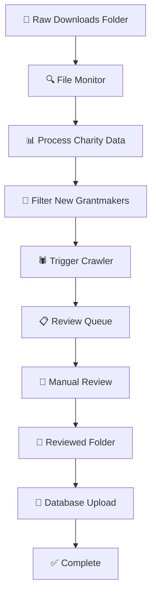

# Monthly Charity Register Processing System - Implementation Plan

## Overview
Design a fully automated monthly system for processing UK Charity Commission register downloads, filtering for new grantmaking trusts and foundations, and managing the review workflow.

## System Architecture



## Core Components

### 1. Folder Monitoring System
**Purpose**: Monitor specific folders for new files and trigger processing

**Input Folders**:
- `/data/raw_downloads/` - For new charity register downloads
- `/data/reviewed/` - For reviewed spreadsheets

**Functionality**:
- Watch for new ZIP files in raw_downloads
- Watch for new CSV files in reviewed
- Move processed files to archive
- Log all file operations

### 2. Charity Data Processor
**Purpose**: Process Charity Commission files using structured classification codes

**Input**: ZIP files containing:
- `charity` - Main charity data
- `charity_classification` - Classification codes
- Data Definition document

**Processing Steps**:
1. Extract ZIP files
2. Parse data using Charity Commission format
3. Join charity and classification data
4. Apply structured filters:
   - Operational method = "Makes Grants To Organisations"
   - OR Grantmaking flag = TRUE
5. Filter by date (first day of last month)
6. Filter for active charities only

**Output**: Filtered list of new grantmaking trusts

### 3. Date Filter Logic
**Purpose**: Identify charities registered in the previous month

**Date Calculation**:
- Current date: December 13, 2025
- Target period: November 1-30, 2025
- Filter: `date_of_registration >= '2025-11-01' AND date_of_registration < '2025-12-01'`

**Field Names** (from Data Definition):
- `date_of_registration`
- `reg_status` (filter for active)
- `regno` (registration number for joins)

### 4. Crawler Integration
**Purpose**: Trigger the main pipeline crawler for new qualifying entries

**Integration Points**:
- Call `azure_production_pipeline.py` with filtered list
- Pass only the new registrations to avoid reprocessing
- Track which entries have been crawled
- Handle partial processing (if crawler fails mid-run)

### 5. Review Interface
**Purpose**: Enable manual review of all classification results

**Review Data Structure**:
```
Charity Number | Name | Website | Initial Classification | Manual Review | Notes
1234567 | ABC Trust | https://abc.org | Grantmaking Trust | [Dropdown: 7 options] | Reviewer notes
```

**7 Classification Options**:
1. Grantmaking Trust
2. Grantmaking Foundation  
3. Operational Charity (provides services)
4. Fundraising Charity
5. Religious Organization
6. Educational Institution
7. Other (specify)

**Review Features**:
- Web links for easy verification
- Initial AI classification for comparison
- Notes field for reviewer comments
- Export to CSV for manual review

### 6. Database Upload System
**Purpose**: Import reviewed data into the main database

**Upload Process**:
1. Read reviewed CSV from folder
2. Validate data format
3. Map to existing database schema
4. Import into `funders` table
5. Update tracking tables
6. Generate import report

## Technical Implementation

### File Structure
```
/data/
├── raw_downloads/          # New charity register ZIP files
├── processed/             # Processed charity data
├── review_queue/          # Data ready for review
├── reviewed/              # Reviewed CSV files
├── archive/               # Completed files
└── logs/                  # Processing logs
```

### Database Schema Additions
```sql
-- New table for tracking monthly imports
CREATE TABLE monthly_imports (
    id SERIAL PRIMARY KEY,
    import_date DATE NOT NULL,
    source_file VARCHAR(500),
    total_processed INTEGER,
    grantmakers_found INTEGER,
    crawler_triggered INTEGER,
    review_completed INTEGER,
    database_imported INTEGER,
    status VARCHAR(50),
    created_at TIMESTAMP DEFAULT CURRENT_TIMESTAMP
);

-- Enhanced funders table for monthly tracking
ALTER TABLE funders ADD COLUMN monthly_import_id INTEGER REFERENCES monthly_imports(id);
ALTER TABLE funders ADD COLUMN initial_classification VARCHAR(100);
ALTER TABLE funders ADD COLUMN manual_review_classification VARCHAR(100);
ALTER TABLE funders ADD COLUMN review_notes TEXT;
```

### Error Handling
- Retry failed downloads
- Log processing errors
- Partial processing recovery
- Email notifications for failures

## Workflow Steps

### Step 1: User Downloads Charity Register
1. User manually downloads from: https://register-of-charities.charitycommission.gov.uk/register/full-register-download
2. Saves ZIP file to `/data/raw_downloads/`
3. System detects new file automatically

### Step 2: Automated Processing
1. System extracts and processes charity data
2. Applies structured classification filters
3. Identifies new grantmaking trusts from previous month
4. Generates review queue with initial classifications
5. Triggers crawler for qualifying entries

### Step 3: Manual Review
1. Reviewer accesses review queue (CSV file or web interface)
2. Reviews each entry and selects proper classification
3. Adds notes for complex cases
4. Saves reviewed file to `/data/reviewed/`

### Step 4: Database Import
1. System detects reviewed file
2. Validates and imports data
3. Updates tracking tables
4. Generates import report
5. Moves files to archive

## Key Benefits
- **Fully Automated**: Minimal manual intervention required
- **Structured Approach**: Uses Charity Commission official codes
- **Quality Control**: Manual review ensures accuracy
- **Scalable**: Handles large monthly datasets
- **Auditable**: Complete tracking of all processing steps

## Next Steps
1. Implement folder monitoring system
2. Create charity data processor
3. Build review interface
4. Integrate with existing crawler
5. Test with sample data