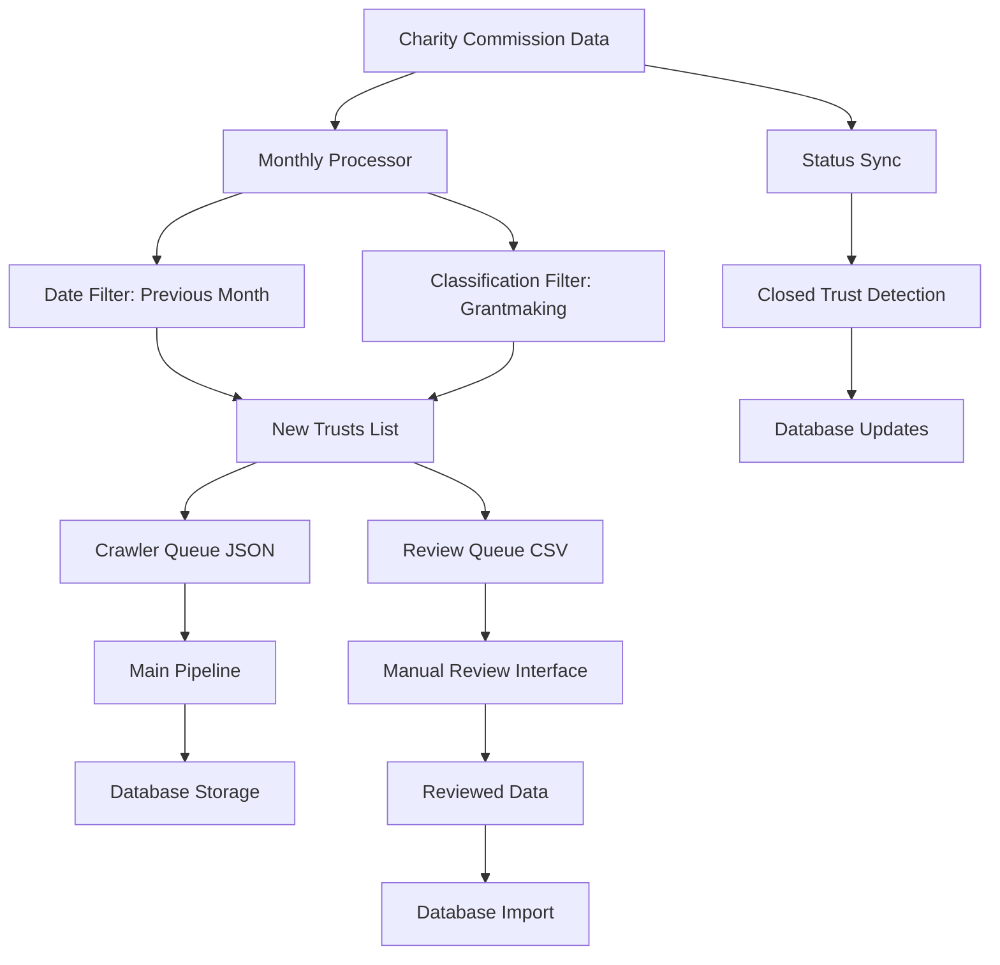

# Monthly Charity Processing Architecture

## Overview

This document outlines the complete architecture for the automated monthly charity register processing system, designed to identify and process new grantmaking trusts from the UK Charity Commission.

## System Components

### 1. Data Sources
- **Charity Commission Public Data Extract**
  - URL: `https://ccewuksprdoneregsdata1.blob.core.windows.net/data/txt/publicextract.charity.zip`
  - Contains: 394,886 charity records
  - Format: JSON with charity and classification data
  - Update Frequency: Monthly

### 2. Core Processing Components

#### A. Monthly Charity Processor (`monthly_charity_processor.py`)
**Purpose**: Process Charity Commission data and identify new grantmaking trusts

**Key Functions**:
- Download and extract Charity Commission data
- Filter charities by registration date (previous month)
- Apply grantmaking classification filters (codes 301, 302)
- Create review queues for manual verification
- Generate crawler queue files for automatic processing

**Data Flow**:
```
Raw Data → Processing → Filtering → Review Queue + Crawler Queue
```

#### B. Database Schema (`migration_monthly_tracking.py`)
**New Tables**:
- `monthly_imports`: Track processing runs and statistics
- Enhanced `funders` table with review tracking fields

**Enhanced Fields**:
- `monthly_import_id`: Links to processing run
- `initial_classification`: AI-assigned classification
- `manual_review_classification`: Human-verified classification
- `review_notes`: Reviewer comments
- `reviewer_name`: Who reviewed the entry
- `review_date`: When reviewed
- `import_batch_id`: Batch identifier

#### C. Review Interface (`review_interface_generator.py`)
**Purpose**: Generate manual review interface for trust classification

**Features**:
- 7-classification system for manual verification
- CSV format for easy review
- Validation and error handling
- Batch processing support

#### D. Status Sync (`auto_sync_charity_status.py`)
**Purpose**: Maintain data quality by checking for closed trusts

**Functions**:
- Link missing charity numbers to existing trusts
- Deactivate trusts that have been removed from register
- Update database with current Charity Commission status

### 3. Integration Components

#### A. Main Pipeline Integration
**File**: `azure_production_pipeline.py`
**Function**: `load_new_trusts_from_queue()`

**Integration Points**:
- Automatically detects latest `trusts_to_crawl_*.json` files
- Converts trust data to foundation format
- Feeds new trusts into main crawling pipeline
- Enables seamless automated processing

#### B. Database Migration
**File**: `migration_monthly_tracking.py`
**Purpose**: Add tracking fields to existing database schema

## Data Flow Architecture



## Processing Workflow

### Step 1: Data Acquisition
1. **Download**: Monthly charity register from Charity Commission
2. **Extract**: Parse JSON files (charity + classification data)
3. **Validate**: Check data integrity and format compliance

### Step 2: Filtering and Analysis
1. **Date Filtering**: Select charities registered in previous month
2. **Classification Filtering**: Apply grantmaking criteria (codes 301, 302)
3. **Quality Checks**: Remove duplicates and invalid entries

### Step 3: Queue Generation
1. **Review Queue**: Create CSV for manual verification
2. **Crawler Queue**: Generate JSON for automated processing
3. **Database Integration**: Link to existing system

### Step 4: Processing Paths

#### Automated Path (High Confidence)
- Trusts with clear grantmaking classification
- Direct integration with main crawling pipeline
- Minimal manual intervention required

#### Manual Review Path (Uncertain Classification)
- Review interface for human verification
- 7-classification system:
  1. Grantmaking Trust
  2. Grantmaking Foundation
  3. Operational Charity
  4. Fundraising Charity
  5. Religious Organization
  6. Educational Institution
  7. Other (specify)

### Step 5: Integration and Storage
1. **Database Updates**: Store reviewed and processed data
2. **Main Pipeline**: Trigger crawling for qualifying trusts
3. **Status Monitoring**: Track processing success rates

## Database Schema

### Enhanced Funders Table
```sql
ALTER TABLE funders ADD COLUMN:
- monthly_import_id INTEGER REFERENCES monthly_imports(id)
- initial_classification VARCHAR(50)
- manual_review_classification VARCHAR(50)
- review_notes TEXT
- reviewer_name VARCHAR(100)
- review_date TIMESTAMP
- import_batch_id VARCHAR(50)
```

### Monthly Imports Table
```sql
CREATE TABLE monthly_imports (
    id SERIAL PRIMARY KEY,
    processing_date DATE NOT NULL,
    total_charities_processed INTEGER,
    new_trusts_found INTEGER,
    review_queue_created BOOLEAN,
    crawler_queue_created BOOLEAN,
    processing_status VARCHAR(20),
    created_at TIMESTAMP DEFAULT CURRENT_TIMESTAMP
);
```

## File System Structure

```
data/
├── raw_downloads/          # Raw Charity Commission files
├── processed/              # Extracted and processed data
│   ├── publicextract.charity/
│   └── trusts_to_crawl_*.json
├── review_queue/           # Manual review files
├── reviewed/              # Completed reviews
├── archive/               # Historical data
└── logs/                  # Processing logs
```

## Error Handling and Monitoring

### Error Categories
1. **Data Acquisition**: Network issues, file corruption
2. **Processing**: Invalid JSON, missing fields
3. **Database**: Connection failures, schema conflicts
4. **Integration**: Pipeline compatibility issues

### Monitoring Points
- Download success rate
- Processing completion status
- Review queue generation
- Database update success
- Integration pipeline health

### Logging Strategy
- Structured logging with timestamps
- Component-specific log files
- Error categorization and tracking
- Performance metrics collection

## Security Considerations

### Data Protection
- Secure file handling for sensitive charity data
- Database access controls and authentication
- Audit trail for all database modifications

### Processing Security
- Input validation for all external data
- Safe JSON parsing and error handling
- Resource cleanup and memory management

## Performance Characteristics

### Processing Capacity
- **Dataset Size**: 394,886 charity records
- **Processing Time**: ~10 minutes for full dataset
- **Memory Usage**: Optimized for large JSON files
- **Database Operations**: Batch processing for efficiency

### Scalability Design
- Efficient JSON streaming for large datasets
- Database connection pooling
- Batch processing for database operations
- Parallel processing where applicable

## Integration Points

### External Systems
- **Charity Commission API**: Data source
- **Azure PostgreSQL**: Database storage
- **Main Crawling Pipeline**: Automated processing

### Internal Components
- **Monthly Processor**: Core processing logic
- **Review Interface**: Manual verification
- **Status Sync**: Data quality maintenance
- **Migration Scripts**: Database schema updates

## Deployment and Operations

### Prerequisites
- Python 3.8+ with required dependencies
- Azure PostgreSQL database access
- Environment configuration (.env file)
- Sufficient disk space for data processing

### Operational Steps
1. **Monthly Setup**: Download new Charity Commission data
2. **Processing Run**: Execute monthly processor
3. **Review Phase**: Manual verification of review queue
4. **Integration**: Automatic pipeline processing
5. **Monitoring**: Track success rates and errors

### Maintenance Tasks
- Database schema updates
- Error log review and cleanup
- Performance monitoring and optimization
- Integration testing with main pipeline

## Future Enhancements

### Automated Scheduling
- Cron-based monthly processing
- Automated review queue distribution
- Integration with existing scheduling systems

### Enhanced Classification
- Machine learning classification improvements
- Multi-source data integration
- Historical pattern analysis

### Scalability Improvements
- Distributed processing for larger datasets
- Cloud-native architecture
- Real-time processing capabilities

## Conclusion

This architecture provides a robust, scalable solution for monthly charity register processing, with clear separation of concerns, comprehensive error handling, and seamless integration with existing systems. The design supports both automated and manual processing paths, ensuring data quality while maintaining operational efficiency.